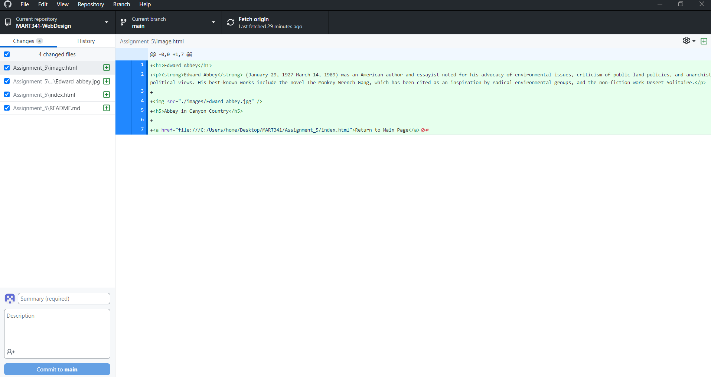

# Assignment 5 
#### Bridger Fiore

## Desert Solitaire: A Season in the Wilderness
### By: Edward Abbey 
##### **Desert Solitaire: A Season in the Wilderness** is an autobiographical work by American writer Edward Abbey, originally published in 1968. It is his fourth book and his first book-length non-fiction work. The book follows three fictional books: Jonathan Troy (1954), The Brave Cowboy (1956), and Fire on the Mountain (1962). Although it initially garnered little attention, Desert Solitaire was eventually recognized as an iconic work of nature writing and a staple of early environmentalist writing, bringing Abbey critical acclaim and popularity as a writer of environmental, political, and philosophical issues.Based on Abbey's activities as a park ranger at Arches National Monument (now Arches National Park) in the late 1950s, the book is often compared to Henry David Thoreau's Walden and Aldo Leopold's A Sand County Almanac. It is written as a series of vignettes about Abbey's experiences in the Colorado Plateau region of the desert Southwestern United States, ranging from vivid descriptions of the fauna, flora, geology, and human inhabitants of the area, to firsthand accounts of wilderness exploration and river running, to a polemic against development and excessive tourism in the national parks, to stories of the author's work with a search and rescue team to pull a human corpse out of the desert. The book is interspersed with observations and discussions about the various tensions – physical, social, and existential – between humans and the desert environment. Many of the chapters also engage in lengthy critiques of modern Western civilization, United States politics, and the decline of America's natural environment.